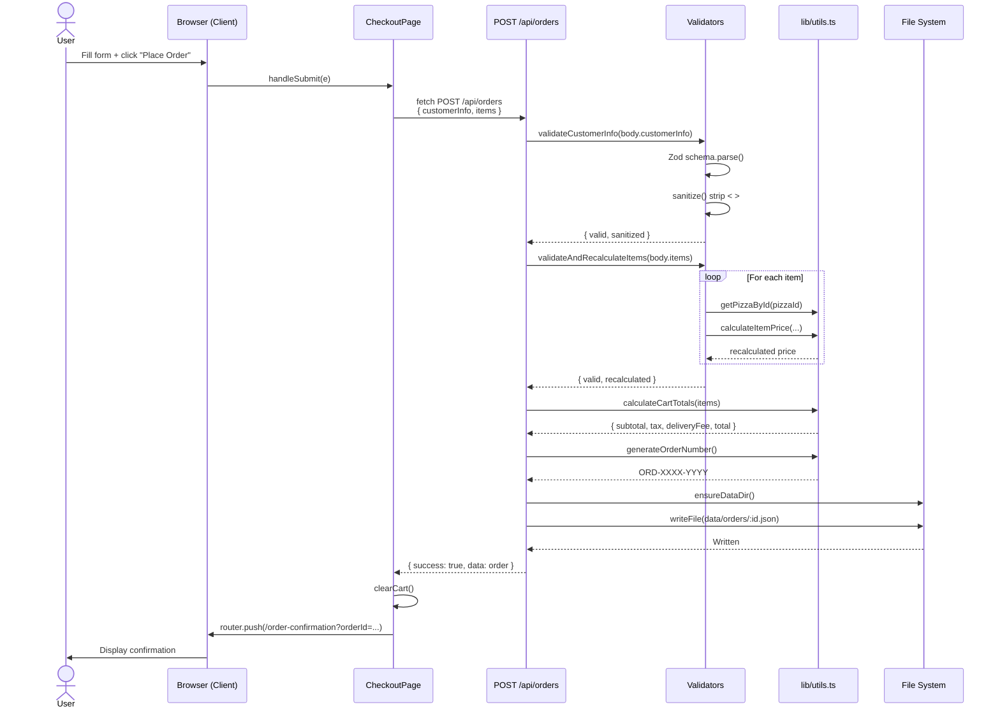

# Order Flow Diagram

This document illustrates the complete order lifecycle in the Pizza App, from menu browsing through order confirmation, showing the key functions and components an order passes through.

## High-Level Order Flow

```mermaid
flowchart TD
    Start([User visits site]) --> Menu[Menu Page<br/>app/menu/page.tsx]
    Menu --> PizzaCard[PizzaCard Component<br/>components/PizzaCard.tsx]
    
    PizzaCard --> SelectSize[User selects size]
    SelectSize --> SelectCheese[User selects cheese]
    SelectCheese --> AddToCart[handleAddToCart]
    
    AddToCart --> CartContext[CartContext.addItem<br/>contexts/CartContext.tsx]
    CartContext --> CalcPrice[calculateItemPrice<br/>lib/utils.ts]
    CalcPrice --> Reducer[cartReducer: ADD_ITEM]
    Reducer --> LocalStorage[(localStorage<br/>pizza-cart)]
    
    LocalStorage --> CartPage[Cart Page<br/>app/cart/page.tsx]
    CartPage --> CartItem[CartItem Component<br/>components/CartItem.tsx]
    CartItem --> CartSummary[CartSummary<br/>calculateCartTotals]
    
    CartSummary --> Checkout[Checkout Page<br/>app/checkout/page.tsx]
    Checkout --> FillForm[User fills CustomerInfo form]
    FillForm --> Submit[handleSubmit]
    
    Submit --> PostAPI[POST /api/orders]
    PostAPI --> ServerValidate{Server Validation}
    
    ServerValidate --> ValidateCustomer[validateCustomerInfo<br/>Zod schema + XSS sanitize]
    ValidateCustomer --> ValidateItems[validateAndRecalculateItems<br/>Server-side price check]
    ValidateItems --> CalcTotals[calculateCartTotals<br/>subtotal + tax + delivery]
    
    CalcTotals --> BuildOrder[Build Order object<br/>+ generateOrderNumber]
    BuildOrder --> EnsureDir[ensureDataDir]
    EnsureDir --> WriteFile[(writeFile<br/>data/orders/:id.json)]
    
    WriteFile --> Response[Return order response]
    Response --> ClearCart[clearCart]
    ClearCart --> Redirect[Router: /order-confirmation]
    
    Redirect --> Confirmation[Order Confirmation Page<br/>app/order-confirmation/page.tsx]
    Confirmation --> GetOrder[GET /api/orders/:id]
    GetOrder --> ReadFile[(readFile<br/>data/orders/:id.json)]
    ReadFile --> Display[Display order details]
    Display --> End([Order complete])
    
    ValidateCustomer -- invalid --> Error400[400: Return validation error]
    ValidateItems -- invalid --> Error400
    ServerValidate -- exception --> Error500[500: Generic error]
    
    style Start fill:#10b981,color:#fff
    style End fill:#10b981,color:#fff
    style PostAPI fill:#ef4444,color:#fff
    style GetOrder fill:#ef4444,color:#fff
    style LocalStorage fill:#f59e0b,color:#fff
    style WriteFile fill:#f59e0b,color:#fff
    style ReadFile fill:#f59e0b,color:#fff
    style Error400 fill:#dc2626,color:#fff
    style Error500 fill:#dc2626,color:#fff
```

## Sequence Diagram — Order Creation

## Function Reference

| Function | File | Purpose |
|----------|------|---------|
| `handleAddToCart` | [components/PizzaCard.tsx](../components/PizzaCard.tsx) | Triggers cart addition from UI |
| `addItem` | [contexts/CartContext.tsx](../contexts/CartContext.tsx) | Dispatches ADD_ITEM action |
| `cartReducer` | [contexts/CartContext.tsx](../contexts/CartContext.tsx) | Manages cart state transitions |
| `calculateItemPrice` | [lib/utils.ts](../lib/utils.ts) | Computes pizza + toppings price |
| `calculateCartTotals` | [lib/utils.ts](../lib/utils.ts) | Computes subtotal, tax, delivery, total |
| `handleSubmit` | [app/checkout/page.tsx](../app/checkout/page.tsx) | Posts order to API |
| `validateCustomerInfo` | [app/api/orders/route.ts](../app/api/orders/route.ts) | Validates + sanitizes customer data |
| `validateAndRecalculateItems` | [app/api/orders/route.ts](../app/api/orders/route.ts) | Server-side price verification |
| `generateOrderNumber` | [lib/utils.ts](../lib/utils.ts) | Creates unique order number |
| `ensureDataDir` | [app/api/orders/route.ts](../app/api/orders/route.ts) | Creates storage directory |
| `GET /api/orders/[id]` | [app/api/orders/[id]/route.ts](../app/api/orders/[id]/route.ts) | Retrieves order for confirmation |

## Key Security Checkpoints

1. **Client-side prices are never trusted** — server recalculates all prices via `calculateItemPrice` using menu data.
2. **Zod validation** ensures customer info matches strict schema (email format, phone regex, length limits).
3. **XSS sanitization** strips `<` and `>` from text fields.
4. **DoS protection** — `MAX_ITEMS = 50` and `MAX_STRING_LENGTH = 500`.
5. **Quantity bounds** — enforced between 1 and 20 per line item.
